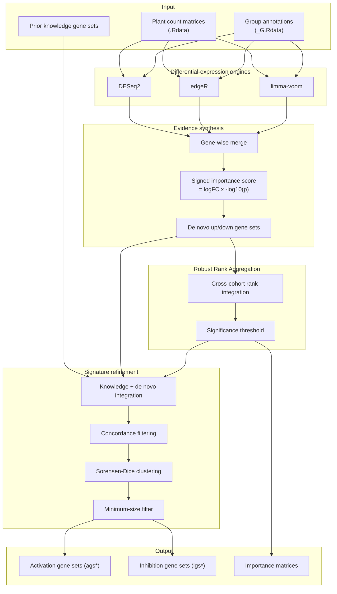

# PhytoQuant

PhytoQuant is an integrated, direction-aware gene-signature discovery framework
for plant transcriptome cohorts. It combines three differential-expression
engines, robust cross-cohort evidence synthesis, knowledge-guided refinement,
and Sorensen-Dice-based redundancy removal in a single reproducible pipeline.

## Highlights

- **Multi-engine differential expression.** DESeq2, edgeR, and limma-voom are
  run in parallel and merged into one signed importance score per gene.
- **Cross-cohort reproducibility.** Robust Rank Aggregation synthesizes evidence
  across independent plant expression cohorts before gene selection.
- **Direction-resolved signatures.** Activation and inhibition are discovered
  separately, preserving the regulatory direction of each candidate gene set.
- **Knowledge-guided de novo discovery.** Prior plant pathway gene sets are
  integrated with data-driven de novo gene sets through concordance filtering.
- **Redundancy-aware consolidation.** Sorensen-Dice similarity and hierarchical
  clustering remove overlapping signatures while retaining compact gene sets.
- **Translation-ready output.** The final `ags*` activation and `igs*`
  inhibition panels are immediately usable for enrichment, scoring, and
  experimental follow-up.

## Pipeline overview



## Installation

Start from a clean R session and install the development dependencies:

```r
install.packages(c("pak", "remotes"))
install.packages("BiocManager")
BiocManager::install(c("DESeq2", "edgeR", "limma", "RobustRankAggreg"))
```

Then install PhytoQuant directly from GitHub:

```r
pak::pkg_install("DK-Zhao1999/PhytoQuant")
```

The `remotes` equivalent is:

```r
remotes::install_github("DK-Zhao1999/PhytoQuant", upgrade = FALSE)
```

Load the package:

```r
library(PhytoQuant)
```

## Quick start with simulated plant data

The complete example below is designed to run in a fresh R session. It first
creates three independent plant RNA-seq-like count cohorts, then discovers
activation and inhibition gene sets with `diffexp_integrate()`.

```r
library(PhytoQuant)

# Create a temporary directory for the example data.
data_dir <- tempfile("phyto_demo_")
dir.create(data_dir)

set.seed(42)
n_genes <- 100
n_h <- 6
n_l <- 6

genes <- paste0("PHYTO", sprintf("%03d", seq_len(n_genes)))
up_genes <- paste0("PHYTO", sprintf("%03d", 1:10))
dn_genes <- paste0("PHYTO", sprintf("%03d", 11:20))

# Simulate a negative-binomial count matrix with planted directional signal.
make_counts <- function(seed, genes, up_genes, dn_genes, n_h, n_l) {
  set.seed(seed)
  n_samples <- n_h + n_l
  mu <- matrix(100, nrow = length(genes), ncol = n_samples)
  mu[match(up_genes, genes), seq_len(n_h)] <- 1000
  mu[match(dn_genes, genes), n_h + seq_len(n_l)] <- 1000
  matrix(
    rnbinom(length(genes) * n_samples, size = 20, mu = mu),
    nrow = length(genes),
    ncol = n_samples,
    dimnames = list(genes, paste0("S", seq_len(n_samples)))
  )
}

# Save each simulated cohort in the layout expected by PhytoQuant.
for (dataset_name in c("PhytoA", "PhytoB", "PhytoC")) {
  seed <- switch(dataset_name, PhytoA = 1, PhytoB = 2, PhytoC = 3)
  expr <- make_counts(seed, genes, up_genes, dn_genes, n_h, n_l)
  group <- data.frame(
    Tag = colnames(expr),
    group = c(rep("H", n_h), rep("L", n_l)),
    stringsAsFactors = FALSE
  )

  assign(dataset_name, expr)
  assign(paste0(dataset_name, "_G"), group)
  save(list = dataset_name, file = file.path(data_dir, paste0(dataset_name, ".Rdata")))
  save(list = paste0(dataset_name, "_G"), file = file.path(data_dir, paste0(dataset_name, "_G.Rdata")))
}

# Prior knowledge gene sets used as plant pathway hypotheses.
knowledge_genesets <- list(
  auxin_signaling = up_genes,
  ethylene_signaling = dn_genes,
  gibberellin_biosynthesis = paste0("PHYTO", sprintf("%03d", 21:30)),
  jasmonate_response = paste0("PHYTO", sprintf("%03d", 31:40)),
  salicylic_acid_pathway = paste0("PHYTO", sprintf("%03d", 41:50))
)

result <- diffexp_integrate(
  vector = c("PhytoA", "PhytoB", "PhytoC"),
  geneSets_list = knowledge_genesets,
  data_dir = data_dir,
  importance_threshold = 1,
  rra_p_threshold = 0.01,
  sorenson_threshold = 0.7,
  min_geneset_size = 3,
  save_intermediate = FALSE,
  methods = c("DESeq2", "edgeR", "limma"),
  linkage_method = "complete",
  verbose = TRUE
)

str(result$activation_gene_sets)
str(result$inhibition_gene_sets)
head(result$importance_all)
```

The planted activation genes are `PHYTO001`-`PHYTO010`, and the planted
inhibition genes are `PHYTO011`-`PHYTO020`. When the three cohorts are analyzed
and integrated, PhytoQuant returns these genes inside the compact final
`ags*` and `igs*` panels.

## Input data format

For every name in `vector`, PhytoQuant expects two RData files in `data_dir`:

```text
<name>.Rdata
<name>_G.Rdata
```

The first file must contain a raw count matrix assigned to an object named
`<name>`. Rows are genes and columns are samples. The second file must contain
a data frame assigned to `<name>_G` with columns:

```text
Tag    group
S1     H
S2     H
S3     L
S4     L
```

The `group` values are interpreted relative to `levels = c("L", "H")`, so a
positive log-fold change corresponds to higher expression in `H`.

## Function reference

### `diffexp_integrate()`

```r
diffexp_integrate(
  vector,
  geneSets_list,
  data_dir = getwd(),
  importance_threshold = 10,
  rra_p_threshold = 0.00001,
  sorenson_threshold = 0.6,
  min_geneset_size = 5,
  max_na_ratio = 0.3,
  save_intermediate = FALSE,
  methods = c("DESeq2", "edgeR", "limma"),
  linkage_method = "complete",
  verbose = TRUE
)
```

| Argument | Description | Default |
| --- | --- | --- |
| `vector` | Dataset names to process. | required |
| `geneSets_list` | Named list of prior knowledge gene sets. | required |
| `data_dir` | Directory containing the RData files. | `getwd()` |
| `importance_threshold` | Absolute importance threshold for de novo genes. | `10` |
| `rra_p_threshold` | Cross-dataset robust-rank-aggregation p-value threshold. | `0.00001` |
| `sorenson_threshold` | Sorensen-Dice threshold for merging redundant sets. | `0.6` |
| `min_geneset_size` | Minimum genes per final gene set. | `5` |
| `max_na_ratio` | Maximum missing-value proportion per gene. | `0.3` |
| `save_intermediate` | Save per-dataset merged result tables. | `FALSE` |
| `methods` | Differential-expression methods to run. | `c("DESeq2", "edgeR", "limma")` |
| `linkage_method` | Clustering linkage for merging. | `"complete"` |
| `verbose` | Print progress messages. | `TRUE` |

The function returns:

```r
list(
  activation_gene_sets,
  inhibition_gene_sets,
  importance_all,
  importance_up_gene,
  importance_dn_gene
)
```

## Notes

1. The expression files are read with `load()` and are expected to contain raw
   counts. DESeq2 and edgeR require non-negative integer counts.
2. All input datasets are analyzed independently before evidence is integrated
   across cohorts, so missing genes are handled explicitly by `max_na_ratio`.
3. For exploratory runs on small or noisy simulations, relaxed thresholds such
   as `importance_threshold = 1` and `rra_p_threshold = 0.01` make the output
   easier to inspect without changing the method.

## Author

Dingkang Zhao

Email: <dingkang.25@intl.zju.edu.cn>
