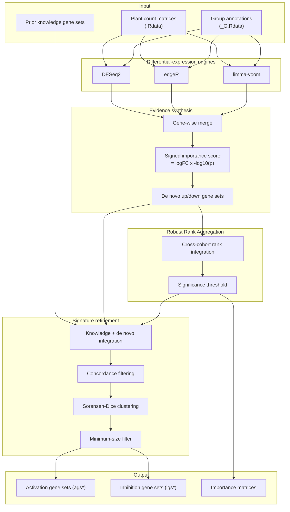
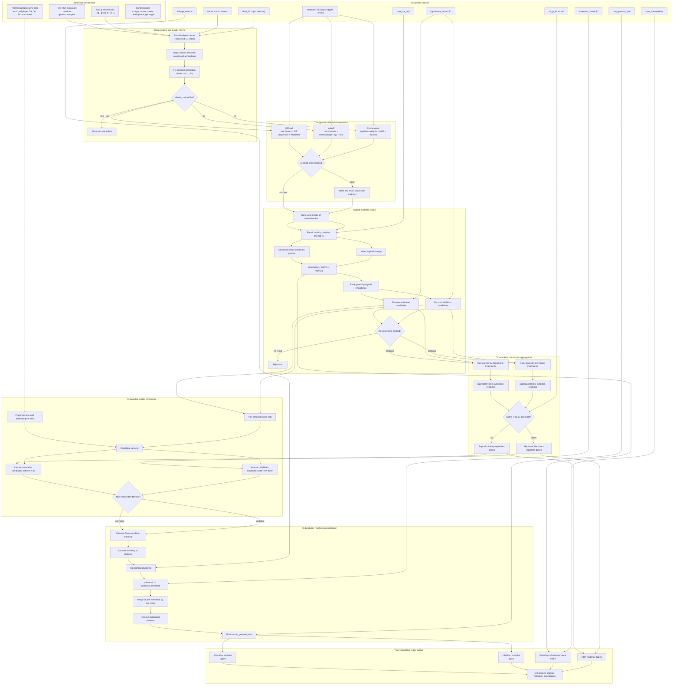

# PhytoQuant

PhytoQuant is a cohort-resolved, direction-aware transcriptome-signature discovery engine specifically designed for plant functional genomics. Unlike conventional differential expression workflows that reduce multi-cohort evidence to a flat list of genes, PhytoQuant triangulates three orthogonal statistical frameworks—DESeq2, edgeR, and limma-voom—under distinct distributional assumptions, fusing their evidence into a signed gene-level importance score. This statistical triangulation, rather than a simple consensus vote, attenuates method-specific biases while preserving biological directionality. Through cohort-level Robust Rank Aggregation, PhytoQuant separates reproducible regulatory signals from cohort-specific technical variation, enabling robust cross-study meta-analysis across ecotypes, stress treatments, developmental stages, or genetic backgrounds. The framework further models activation and inhibition as separate evidence streams, avoiding the information loss inherent in unsigned enrichment scores, and combines prior pathway annotations with data-driven de novo candidates through set-theoretic concordance filtering. Finally, redundancy-resolving consolidation via Sorensen-Dice similarity and hierarchical clustering delivers compact, directionally labeled gene modules—designated as ags* (activation) and igs* (inhibition)—that are immediately reusable for enrichment analysis, signature scoring, validation cohort testing, and wet-lab candidate prioritization. The result is a transparent, auditable, and experimentally tractable pathway signature rather than a static list of differentially expressed genes, positioning PhytoQuant as a principled solution for hypothesis-driven discovery in plant multi-cohort studies.

## Highlights

- **Statistical triangulation, not consensus voting.** DESeq2, edgeR, and
  limma-voom operate in parallel under distinct distributional assumptions.
  Their evidence is fused into one signed importance score, attenuating
  method-specific biases while preserving biological direction.
- **Cohort-level rank meta-analysis.** Robust Rank Aggregation treats every
  independent plant experiment as a ranking source, separating reproducible
  regulatory signal from cohort-specific technical variation.
- **Direction-resolved signature algebra.** Activation and inhibition are
  modeled as separate evidence streams, avoiding the information loss that
  occurs when unsigned enrichment scores collapse opposing regulators into one
  value.
- **Knowledge-aware de novo discovery.** Prior pathway annotations and
  data-driven de novo candidates are combined through set-theoretic concordance
  filtering, connecting hypothesis-driven biology with discovery-driven
  statistics.
- **Redundancy-resolving consolidation.** Sorensen-Dice similarity, hierarchical
  clustering, and minimum-cardinality filtering jointly remove overlapping
  modules while retaining the most parsimonious interpretable gene sets.
- **Translation-first output.** Final `ags*` activation and `igs*` inhibition
  panels are compact, named, and directly reusable for enrichment analysis,
  signature scoring, validation cohorts, and candidate prioritization.

## Pipeline overview



## Detailed plant-oriented workflow



## Methodological novelty and publication value

PhytoQuant addresses a recurring bottleneck in plant functional genomics:
multi-cohort studies are abundant, but conventional differential-expression
workflows rarely propagate the uncertainty and direction of evidence across
cohorts. PhytoQuant reframes the problem as a hierarchical evidence-integration
task, making it especially suitable for comparative studies across ecotypes,
stress treatments, developmental stages, tissues, or genetic backgrounds.

- **A reproducible analytical object.** Every result retains the underlying
  importance matrix and rank-aggregation statistics, so reviewers can trace how
  a final signature was derived instead of receiving only a gene list.
- **Methodological heterogeneity as a feature.** By deliberately combining
  negative-binomial and linear-model frameworks, PhytoQuant rewards genes whose
  signal is robust across statistical paradigms rather than overfitted to one
  package.
- **Directional biological interpretation.** Separate activation and inhibition
  panels make it possible to propose regulatory hypotheses directly from the
  output, including candidate activators, repressors, and pathway-level switches.
- **Immediate translational utility.** The compact `ags*` and `igs*` modules
  are well suited to signature scoring, cross-study validation, co-expression
  network annotation, and prioritization of targets for wet-lab validation.

## Installation

Start from a clean R session and install the development dependencies:

```r
install.packages(c("pak", "remotes"))
install.packages("BiocManager")
BiocManager::install(c("DESeq2", "edgeR", "limma", "RobustRankAggreg"))
```

Then install PhytoQuant directly from GitHub:

```r
pak::pkg_install("DK-Zhao1999/PhytoQuant")
```

The `remotes` equivalent is:

```r
remotes::install_github("DK-Zhao1999/PhytoQuant", upgrade = FALSE)
```

Load the package:

```r
library(PhytoQuant)
```

## Quick start with simulated plant data

The complete example below is designed to run in a fresh R session and to mimic
the heterogeneity of a multi-cohort plant study. It first constructs three
independent RNA-seq-like count cohorts with planted directional signal, then
uses `diffexp_integrate()` to recover the planted activation and inhibition
modules through the full evidence-integration workflow.

```r
library(PhytoQuant)

# Create a temporary directory for the example data.
data_dir <- tempfile("phyto_demo_")
dir.create(data_dir)

set.seed(42)
n_genes <- 100
n_h <- 6
n_l <- 6

genes <- paste0("PHYTO", sprintf("%03d", seq_len(n_genes)))
up_genes <- paste0("PHYTO", sprintf("%03d", 1:10))
dn_genes <- paste0("PHYTO", sprintf("%03d", 11:20))

# Simulate a negative-binomial count matrix with planted directional signal.
make_counts <- function(seed, genes, up_genes, dn_genes, n_h, n_l) {
  set.seed(seed)
  n_samples <- n_h + n_l
  mu <- matrix(100, nrow = length(genes), ncol = n_samples)
  mu[match(up_genes, genes), seq_len(n_h)] <- 1000
  mu[match(dn_genes, genes), n_h + seq_len(n_l)] <- 1000
  matrix(
    rnbinom(length(genes) * n_samples, size = 20, mu = mu),
    nrow = length(genes),
    ncol = n_samples,
    dimnames = list(genes, paste0("S", seq_len(n_samples)))
  )
}

# Save each simulated cohort in the layout expected by PhytoQuant.
for (dataset_name in c("PhytoA", "PhytoB", "PhytoC")) {
  seed <- switch(dataset_name, PhytoA = 1, PhytoB = 2, PhytoC = 3)
  expr <- make_counts(seed, genes, up_genes, dn_genes, n_h, n_l)
  group <- data.frame(
    Tag = colnames(expr),
    group = c(rep("H", n_h), rep("L", n_l)),
    stringsAsFactors = FALSE
  )

  assign(dataset_name, expr)
  assign(paste0(dataset_name, "_G"), group)
  save(list = dataset_name, file = file.path(data_dir, paste0(dataset_name, ".Rdata")))
  save(list = paste0(dataset_name, "_G"), file = file.path(data_dir, paste0(dataset_name, "_G.Rdata")))
}

# Prior knowledge gene sets used as plant pathway hypotheses.
knowledge_genesets <- list(
  auxin_signaling = up_genes,
  ethylene_signaling = dn_genes,
  gibberellin_biosynthesis = paste0("PHYTO", sprintf("%03d", 21:30)),
  jasmonate_response = paste0("PHYTO", sprintf("%03d", 31:40)),
  salicylic_acid_pathway = paste0("PHYTO", sprintf("%03d", 41:50))
)

result <- diffexp_integrate(
  vector = c("PhytoA", "PhytoB", "PhytoC"),
  geneSets_list = knowledge_genesets,
  data_dir = data_dir,
  importance_threshold = 1,
  rra_p_threshold = 0.01,
  sorenson_threshold = 0.7,
  min_geneset_size = 3,
  save_intermediate = FALSE,
  methods = c("DESeq2", "edgeR", "limma"),
  linkage_method = "complete",
  verbose = TRUE
)

str(result$activation_gene_sets)
str(result$inhibition_gene_sets)
head(result$importance_all)
```

The planted activation genes are `PHYTO001`-`PHYTO010`, and the planted
inhibition genes are `PHYTO011`-`PHYTO020`. When the three cohorts are analyzed
and integrated, PhytoQuant should return these genes inside the compact final
`ags*` and `igs*` panels, while the returned importance matrices provide the
full quantitative evidence trail for downstream reuse.

## Input data format

PhytoQuant uses a minimal, cohort-oriented data contract. For every name in
`vector`, two RData files must be present in `data_dir`:

```text
<name>.Rdata
<name>_G.Rdata
```

The first file must contain a raw count matrix assigned to an object named
`<name>`, with genes as rows and samples as columns. The second file must
contain a sample-level annotation data frame assigned to `<name>_G`:

```text
Tag    group
S1     H
S2     H
S3     L
S4     L
```

The `group` values are interpreted relative to `levels = c("L", "H")`. This
fixed contrast orientation ensures that every downstream signed statistic,
including the final importance score, has a consistent biological meaning: a
positive log-fold change corresponds to higher expression in `H`.

## Function reference

### `diffexp_integrate()`

```r
diffexp_integrate(
  vector,
  geneSets_list,
  data_dir = getwd(),
  importance_threshold = 10,
  rra_p_threshold = 0.00001,
  sorenson_threshold = 0.6,
  min_geneset_size = 5,
  max_na_ratio = 0.3,
  save_intermediate = FALSE,
  methods = c("DESeq2", "edgeR", "limma"),
  linkage_method = "complete",
  verbose = TRUE
)
```

| Argument | Description | Default |
| --- | --- | --- |
| `vector` | Cohort identifiers whose rank evidence will be integrated. | required |
| `geneSets_list` | Named prior-knowledge gene sets used to guide and refine discovery. | required |
| `data_dir` | Directory containing the count and annotation RData files. | `getwd()` |
| `importance_threshold` | Signed-evidence cutoff used to partition de novo up- and down-regulated genes. | `10` |
| `rra_p_threshold` | Cross-cohort significance cutoff for robust rank aggregation. | `0.00001` |
| `sorenson_threshold` | Similarity cutoff controlling redundancy removal among final modules. | `0.6` |
| `min_geneset_size` | Minimum cardinality required for a reproducible final module. | `5` |
| `max_na_ratio` | Maximum fraction of cohorts in which a gene may lack evidence. | `0.3` |
| `save_intermediate` | Persist the per-cohort merged evidence tables for external audit. | `FALSE` |
| `methods` | Orthogonal differential-expression backends used for triangulation. | `c("DESeq2", "edgeR", "limma")` |
| `linkage_method` | Agglomerative linkage rule used during similarity clustering. | `"complete"` |
| `verbose` | Emit trace-level progress diagnostics during the workflow. | `TRUE` |

The function returns:

```r
list(
  activation_gene_sets,
  inhibition_gene_sets,
  importance_all,
  importance_up_gene,
  importance_dn_gene
)
```

## Notes

1. PhytoQuant is designed around raw count matrices rather than normalized
   expression values. This preserves the distributional assumptions of DESeq2
   and edgeR and lets the workflow maintain a coherent, auditable evidence chain
   from counts to final modules.
2. Each cohort is analyzed independently before rank-level integration. Missing
   genes are therefore handled explicitly by `max_na_ratio`, avoiding the
   complete-case bias introduced by premature sample-level intersection.
3. For exploratory runs on small or deliberately noisy simulations, relaxed
   thresholds such as `importance_threshold = 1` and `rra_p_threshold = 0.01`
   expose the full pipeline output without altering the statistical method.

## Author

Dingkang Zhao

Email: <dingkang.25@intl.zju.edu.cn>
